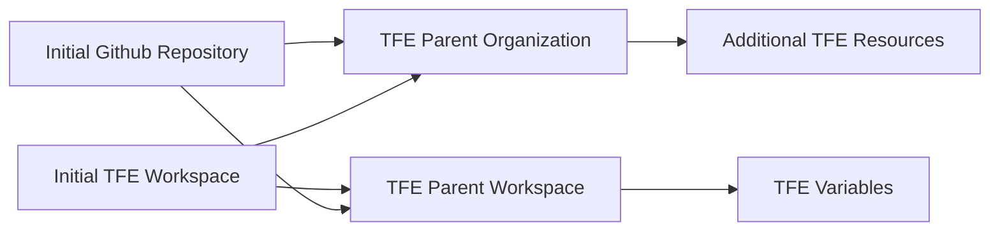

# Mothership

This is the Captain, Commander, and Owner of all things related to my personal infrastructure. Here you will find all resources that ensure my entire infrastructure and code run successfully. This can range from TFE Resources, to Github resources.

# TODO

Modularize this entire workflow. Should be quick and simple to spin up an entire new TFE Organization, TFE Workspace, and GH Repository.

